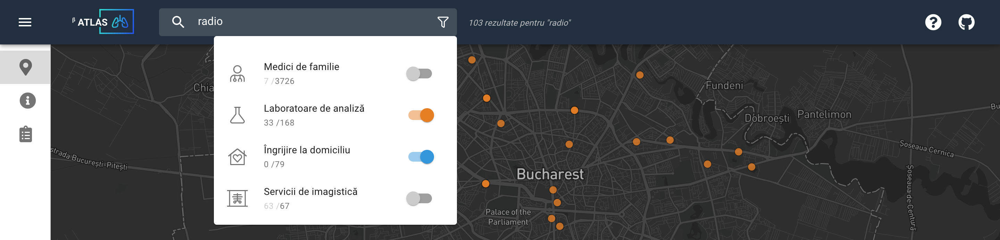

### Atlas / βeta

Un proiect [CivicNet](https://civicnet.ro/) și [Asociația Sănătate pentru Comunitate](https://www.facebook.com/SanatatepentruComunitate).

Ne propunem să dezvoltăm prima aplicație dedicată pacienților de cancer pulmonar din România, navigatorilor acestora, dar și personalului medical.

Aplicația va conține informații importante despre traseul pacienților, de la diagnosticare până la îngrijire paliativă, și informații sub formă de ghiduri pentru pacienți.

În momentul de față, aplicația se află în stadiul de prototip interactiv. Ne puteți urmări pe Facebook pentru a fi la curent cu ultimele noutăți.

	 
	 
	 
  

    Made with :heart: and :coffee: by
  

  
   

 
 
 

> Favicon made by [Freepik](https://www.flaticon.com/authors/freepik) from [www.flaticon.com](www.flaticon.com)
